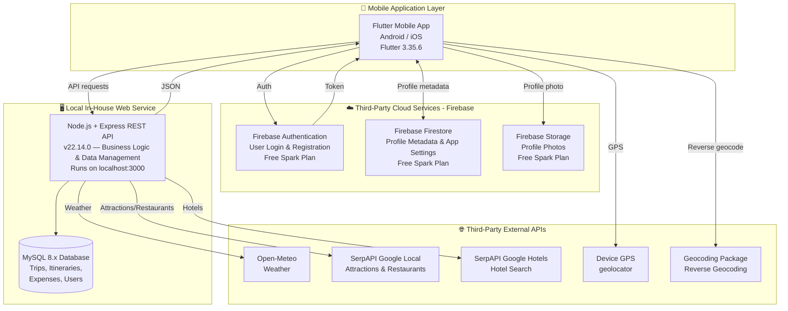
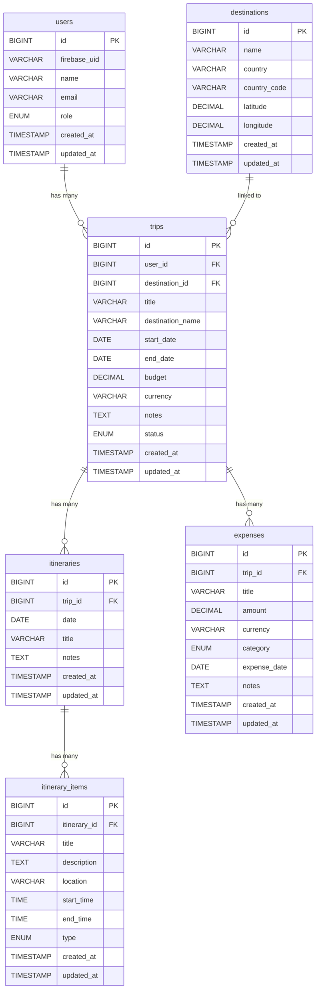

# Smart Travel Planner — System Architecture Document

**Project Code:** ITT632 Group Project
**Project Title:** Smart Travel Planner
**Document Name:** system-architecture.md
**Version:** 2.2
**Date:** 2025

---

## Table of Contents

1. [Executive Summary](#1-executive-summary)
2. [Project Objectives](#2-project-objectives)
3. [System Scope](#3-system-scope)
4. [User Roles](#4-user-roles)
5. [Core System Modules](#5-core-system-modules)
6. [Architecture Decisions](#6-architecture-decisions)
7. [Chosen Cloud Services](#7-chosen-cloud-services)
8. [In-House Web Service](#8-in-house-web-service)
9. [Chosen Tools and Technology Stack](#9-chosen-tools-and-technology-stack)
10. [High-Level System Architecture](#10-high-level-system-architecture)
11. [Data Flow Explanation](#11-data-flow-explanation)
12. [Backend API Design](#12-backend-api-design)
13. [MySQL Database Design](#13-mysql-database-design)
14. [Firebase Data Design](#14-firebase-data-design)
15. [Development Environment Strategy](#15-development-environment-strategy)
16. [Monorepo Folder Structure](#16-monorepo-folder-structure)
17. [Detailed Flutter Folder Structure](#17-detailed-flutter-folder-structure)
18. [Detailed Node.js + Express Folder Structure](#18-detailed-nodejs--express-folder-structure)
19. [Working Tree and Branch Strategy for 4 Coding Team Members](#19-working-tree-and-branch-strategy-for-4-coding-team-members)
20. [Security Considerations](#20-security-considerations)
21. [Deployment and Local Development Plan](#21-deployment-and-local-development-plan)
22. [Testing Strategy](#22-testing-strategy)
23. [UI Design Plan](#23-ui-design-plan)
24. [Screenshots Planning Section](#24-screenshots-planning-section)
25. [Assumptions and Limitations](#25-assumptions-and-limitations)
26. [Recommendation](#26-recommendation)
27. [Conclusion](#27-conclusion)

---

## 1. Executive Summary

Smart Travel Planner is a mobile application developed using Flutter that enables users to plan, organise, and manage travel activities in a structured and efficient manner. The application is designed to address the common challenges faced by modern travellers, including trip organisation, weather uncertainty at destinations, discovery of local tourist attractions, understanding destination country information, and managing travel budgets. By combining a custom in-house backend with multiple cloud-based services, the Smart Travel Planner delivers a comprehensive and connected travel management experience accessible from Android and iOS devices.

The system is built upon a layered cloud architecture in which multiple services collaborate to provide the required functionality. Firebase Authentication provides secure user registration and login, ensuring that user identity is managed by a trusted and established cloud identity platform. Firebase Firestore serves as a supplementary cloud storage solution for lightweight data such as user profile metadata and application settings. Firebase Storage stores profile photos. Weather forecasts are retrieved in real time from the Open-Meteo API, a fully free and openly accessible weather data service that requires no registration. Tourist attractions, restaurants, and hotels are retrieved using SerpAPI. Destination names for trips are entered by the user, and the home screen uses device GPS with the Flutter `geocoding` package for reverse geocoding.

At the core of the system is the in-house Node.js and Express REST API, which acts as the central backend service. The Express API handles all structured business logic including trip planning, itinerary management, expense tracking, and data persistence using a MySQL 8.x relational database. The Flutter mobile application communicates with the Express API over HTTP, and the Express API in turn communicates with external cloud APIs and the MySQL database. During development and demonstration, the Express API runs on a local machine, making the setup accessible and cost-free for the student team.

The Smart Travel Planner fulfils all Mobile Cloud Computing requirements by integrating five distinct third-party cloud services, namely Firebase Authentication, Firebase Firestore, Firebase Storage, Open-Meteo, and SerpAPI, alongside one in-house web service in the form of the Node.js and Express REST API. The complete system demonstrates how a mobile application can leverage cloud computing to provide scalable, feature-rich functionality within a student project context and without requiring a paid infrastructure.

---

## 2. Project Objectives

The following objectives define the scope and intended outcome of the Smart Travel Planner project:

1. To develop a cross-platform mobile application using Flutter 3.35.6 that supports both Android and iOS platforms.
2. To enable users to register and log in securely using Firebase Authentication as a third-party cloud identity provider.
3. To allow users to create, read, update, and delete trip plans through the mobile application.
4. To allow users to create and manage day-by-day itineraries, including individual itinerary items with time, location, and description.
5. To allow users to retrieve real-time weather forecasts for their travel destinations using the Open-Meteo API.
6. To allow users to discover tourist attractions, restaurants, and hotels at their destination using SerpAPI.
7. To allow users to view destination-related reference information and explore attractions, hotels, and restaurants for a chosen destination.
8. To allow users to record travel expenses and manage trip budgets through a dedicated budget tracker module.
9. To integrate an in-house Node.js and Express REST API as the backend web service responsible for business logic, data management, and external API communication.
10. To store all structured relational data including users, trips, itineraries, itinerary items, and expenses in a MySQL 8.x database managed by the Express backend.
11. To apply cloud computing principles in a mobile application environment by integrating multiple third-party cloud services alongside a custom in-house web service.
12. To follow a monorepo project structure that supports organised team collaboration using GitHub.

---

## 3. System Scope

### 3.1 Included in the System

The following features and components are included within the scope of this project:

- Mobile application developed using Flutter 3.35.6, targeting Android and iOS platforms
- User authentication using Firebase Authentication
- User profile management
- Trip creation, update, deletion, and listing
- Day-by-day itinerary management with itinerary items
- Real-time weather forecast retrieval using Open-Meteo API
- Tourist attraction, restaurant, and hotel search using SerpAPI
- Destination detail views for exploring attractions, hotels, and restaurants
- Travel budget and expense tracking
- In-house Node.js and Express REST API as the backend web service
- MySQL 8.x relational database for structured data storage
- Firebase Firestore for cloud data such as profile metadata and application settings
- Integration with external APIs via the Express backend
- Monorepo project structure hosted on GitHub

### 3.2 Excluded from the System

The following features are explicitly excluded from the current version of the system:

- Flight booking or airline integration
- Hotel booking or accommodation reservation
- Online payment processing or payment gateway integration
- Trip sharing or travel buddy collaboration features
- Push notifications or Firebase Cloud Messaging
- Offline mode or local data caching for offline use

---

## 4. User Roles

The Smart Travel Planner system defines two distinct user roles as described below.

### 4.1 User / Traveller

The primary user of the application is the Traveller. This user interacts with the mobile application to plan and manage personal travel activities. The Traveller role includes the following capabilities:

- Register a new account and log in using Firebase Authentication
- View and update their personal profile information
- Create new trip plans with destination, date range, budget, and notes
- Update or delete existing trip plans
- Add day-by-day itineraries to a trip
- Add individual itinerary items to each itinerary day including time, location, and activity description
- View weather forecasts for their travel destination
- Search for and view tourist attractions, hotels, and restaurants at their destination
- Record travel expenses and monitor their trip budget

### 4.2 Admin

The Admin role is intended for internal system management and data oversight. The Admin accesses the system through designated admin API endpoints and is responsible for the following:

- Viewing a list of all registered users in the system
- Managing basic destination records if required for the application
- Monitoring system data for quality and integrity
- Deleting or managing trip records if required for administrative purposes
- Supporting backend data operations to ensure system stability

---

## 5. Core System Modules

### 5.1 Authentication Module

**Purpose:** Manages user registration, login, and session handling across the application.

**Main Features:**
- User registration using email and password via Firebase Authentication
- User login using email and password
- Firebase UID retrieval and storage in the Flutter application
- Firebase ID token validation via Express middleware for protected API routes
- User session management within the Flutter application state

**Related Technology:** Firebase Authentication, Flutter Firebase SDK, Express.js Middleware

**Related Database or Cloud Service:** Firebase Authentication, `users` table in MySQL

---

### 5.2 User Profile Module

**Purpose:** Allows users to view and update their personal profile information stored in both MySQL and Firestore.

**Main Features:**
- Display user name, email, and profile details
- Update name and additional profile fields via the Express API
- Store selected profile metadata in Firebase Firestore for lightweight cloud access
- Synchronise profile data with the MySQL `users` table via the Express backend

**Related Technology:** Flutter, Node.js + Express REST API, Firebase Firestore

**Related Database or Cloud Service:** `users` table in MySQL, Firestore `users` collection

---

### 5.3 Trip Planner Module

**Purpose:** Provides full CRUD management for user trip plans.

**Main Features:**
- Create a new trip with destination name, start date, end date, budget, and notes
- List all trips belonging to the authenticated user
- View trip details including associated itineraries and expenses summary
- Update trip information including destination and dates
- Delete a trip and all associated records through cascading database operations

**Related Technology:** Flutter, Node.js + Express REST API, MySQL

**Related Database or Cloud Service:** `trips` table and `destinations` table in MySQL

---

### 5.4 Itinerary Management Module

**Purpose:** Allows users to organise their trip into a structured day-by-day activity plan.

**Main Features:**
- Create itinerary records linked to a specific trip and date
- Add multiple itinerary items to each itinerary day
- Each item includes a title, description, time, location, and activity type
- Update or delete itinerary items
- View the full itinerary for a trip in chronological order

**Related Technology:** Flutter, Node.js + Express REST API, MySQL

**Related Database or Cloud Service:** `itineraries` table and `itinerary_items` table in MySQL

---

### 5.5 Weather Forecast Module

**Purpose:** Retrieves and displays weather forecast data for a travel destination.

**Main Features:**
- Accept latitude and longitude input from the user or the stored destination record
- Send a request to the Open-Meteo API via the Express backend
- Display current weather conditions and a multi-day forecast
- Show temperature, precipitation probability, wind speed, and weather description

**Related Technology:** Flutter, Node.js + Express REST API, Open-Meteo API

**Related Database or Cloud Service:** Open-Meteo API (external, no local database storage required)

---

### 5.6 Attraction Finder Module

**Purpose:** Helps users discover tourist attractions and places of interest at their travel destination.

**Main Features:**
- Accept a destination name or geographic coordinates as input
- Send a request to SerpAPI via the Express backend
- Display a list of attractions with name, category, and description
- Allow users to browse attractions by category type

**Related Technology:** Flutter, Node.js + Express REST API, SerpAPI

**Related Database or Cloud Service:** SerpAPI (external, no local database storage required)

---

### 5.7 Destination Explorer Module

**Purpose:** Helps users explore a chosen destination through attractions, hotels, and restaurants discovered via SerpAPI.

**Main Features:**
- Open a destination detail view for a selected place name
- Navigate to attractions, hotels, and restaurants search screens for that destination
- Display top attraction results as a quick preview
- Start a new trip from the destination context

**Related Technology:** Flutter, Node.js + Express REST API, SerpAPI

**Related Database or Cloud Service:** SerpAPI (external, no local database storage required)

---

### 5.8 Budget Tracker Module

**Purpose:** Allows users to manage and monitor travel expenses for each trip.

**Main Features:**
- Add expense records linked to a specific trip
- Each expense includes a title, amount, currency, category, and date
- View a list of all expenses for a trip
- Calculate and display the total amount spent against the trip's planned budget
- Update or delete individual expense records

**Related Technology:** Flutter, Node.js + Express REST API, MySQL

**Related Database or Cloud Service:** `expenses` table in MySQL

---

### 5.9 Admin Management Module

**Purpose:** Provides basic administrative oversight of system data.

**Main Features:**
- View all registered users in the system
- View all trip records across all users
- Delete specific trip records if required
- Manage destination records for the application

**Related Technology:** Node.js + Express REST API, MySQL

**Related Database or Cloud Service:** `users` table, `trips` table, `destinations` table in MySQL

---

### 5.10 Express API Module

**Purpose:** Acts as the central in-house web service, handling all backend logic, database operations, and external service communication.

**Main Features:**
- Expose RESTful API endpoints for all application modules
- Validate Firebase Authentication tokens for protected routes using Express middleware
- Handle MySQL database operations through query functions and model classes
- Communicate with external APIs including Open-Meteo and SerpAPI
- Return structured JSON responses to the Flutter application
- Implement role-based middleware to protect admin routes

**Related Technology:** Node.js v22.14.0, Express.js, MySQL 8.x, Firebase Admin SDK

**Related Database or Cloud Service:** MySQL database, Firebase Authentication token validation

---

### 5.11 Cloud Integration Module

**Purpose:** Manages all integration points between the mobile application and cloud services.

**Main Features:**
- Firebase Authentication SDK integration within Flutter
- Firebase Firestore read and write operations for profile and settings data
- Firebase Storage uploads for profile photos
- Open-Meteo API communication via the Express backend
- SerpAPI communication via the Express backend for attractions, restaurants, and hotels
- Device GPS and reverse geocoding on the Flutter client using `geolocator` and `geocoding`
- API key management and environment variable configuration using `.env`

**Related Technology:** Flutter Firebase SDK, Node.js + Express, HTTP client libraries, dotenv

**Related Database or Cloud Service:** Firebase Authentication, Firebase Firestore, Firebase Storage, Open-Meteo, SerpAPI

---

## 6. Architecture Decisions

### 6.1 Flutter

Flutter 3.35.6 is selected as the mobile application framework because it enables the development of a single Dart codebase that compiles natively for both Android and iOS platforms. This significantly reduces development time and effort for a group project with limited resources. Flutter's widget-based architecture promotes reusable UI components, and its rich ecosystem of packages supports Firebase integration, HTTP communication, and state management. Flutter is well-documented, actively maintained, and widely adopted in cross-platform mobile development, making it suitable for a student development team with varying experience levels.

### 6.2 Node.js

Node.js v22.14.0 is selected as the backend runtime environment because it is lightweight, event-driven, and capable of handling asynchronous I/O operations efficiently. Node.js uses JavaScript, a language that most developers are familiar with, reducing the learning curve for team members. Its non-blocking architecture makes it well-suited for an API server that makes multiple external HTTP calls to cloud services and APIs concurrently.

### 6.3 Express.js

Express.js is selected as the in-house REST API framework because it is minimal, un-opinionated, and easy to configure. Unlike heavier full-stack frameworks, Express allows the team to set up routes, middleware, and API endpoints quickly without enforcing a rigid project structure. This flexibility is beneficial for a student project where development speed and simplicity are priorities. Express is also the most widely used Node.js web framework, with extensive community support and documentation.

### 6.4 MySQL

MySQL 8.x is selected as the relational database for the Express backend because it is a proven, open-source database management system that handles structured relational data efficiently. The travel planning domain involves well-defined relationships between users, trips, itineraries, itinerary items, and expenses, all of which are best represented in a normalised relational schema. MySQL 8.x provides improved performance, window functions, and JSON support compared to older versions, and it integrates well with Node.js through the `mysql2` package.

### 6.5 Firebase Authentication

Firebase Authentication is chosen as the user authentication solution because it provides a secure, scalable, and easy-to-integrate identity management service. Firebase Authentication handles password hashing, token generation, and session management, eliminating the need to implement these security-critical features manually. Firebase Authentication is free under the Spark Plan, requires no credit card, and integrates seamlessly with the Flutter Firebase SDK. The Firebase UID generated upon registration is used to link the user identity to the Express MySQL `users` table.

### 6.6 Firebase Firestore

Firebase Firestore is selected as a supplementary cloud storage solution because it provides a NoSQL cloud database accessible directly from the Flutter application without routing through the Express backend. Firestore is suitable for storing lightweight, non-relational data such as user profile metadata and application settings. It is included under the Firebase Spark Plan at no cost and integrates with Flutter through the official Firebase SDK.

### 6.7 Open-Meteo API

Open-Meteo is chosen as the weather forecast provider because it is a fully free, open-source weather API that does not require API key registration or credit card details. It provides accurate, real-time weather data and multi-day forecasts based on latitude and longitude coordinates. Open-Meteo is ideal for a student project with no budget, and its straightforward REST API interface makes it simple to integrate through the Express backend.

### 6.8 SerpAPI

SerpAPI is chosen as the place-discovery provider because a single free-tier key covers three of the app's search features: the Google Local engine returns tourist attractions and restaurants, while the Google Hotels engine returns accommodation with live pricing. Results include ratings, addresses and thumbnails, which is richer than the raw point-of-interest feeds the project first evaluated. The Express backend holds the key in `SERPAPI_KEY` and normalises the JSON before returning it to Flutter.

### 6.9 Firebase Storage

Firebase Storage is chosen for profile photo uploads because it provides managed object storage that integrates directly with Firebase Authentication. Photos are stored under per-user paths, and access can be controlled with Firebase security rules. Storage is included under the Spark Plan at no cost for typical student-project usage and avoids hosting binary files in MySQL or on the Express server.

### 6.10 Device GPS and Geocoding

The Flutter `geolocator` and `geocoding` packages are chosen for the home dashboard location experience. The app reads the device GPS position and reverse-geocodes it to a city name on the client, then requests weather for those coordinates through the Express Open-Meteo proxy. This keeps destination entry for trips as a simple destination name field and avoids depending on a separate third-party country or city lookup API.

### 6.11 Local In-House Web Service

Running the Node.js and Express API locally during development and demonstration is acceptable for a student group project because it removes the need for cloud hosting costs and reduces configuration complexity. During development, the Flutter application connects to the local Express server using the Android emulator IP address `10.0.2.2` or the laptop's local network IP address when testing on a real device. This approach allows the team to focus on feature development rather than deployment operations. Future deployment to Render.com or Railway.app is possible using their free tiers if remote hosting becomes necessary.

### 6.12 GitHub Monorepo

A monorepo structure hosted on GitHub is chosen because it allows all team members to collaborate within a single repository while maintaining clear separation between the Flutter and Express codebases through dedicated subfolders. This approach simplifies repository management, reduces the overhead of managing multiple repositories, and ensures that all project assets including documentation, Postman collections, and both application codebases are stored and versioned together.

---

## 7. Chosen Cloud Services

| Cloud Service | Type | Purpose | Why It Is Chosen | Cost | Used In Which Module |
|---|---|---|---|---|---|
| **Firebase Authentication** | Third-Party Cloud Service | User registration and login | Secure, free identity management with no manual password handling; integrates natively with Flutter via SDK | Free (Spark Plan, no credit card) | Authentication Module, Cloud Integration Module |
| **Firebase Firestore** | Third-Party Cloud Service | Cloud storage for profile metadata and app settings | NoSQL cloud database accessible from Flutter; free under Spark Plan; suitable for lightweight non-relational data | Free (Spark Plan, no credit card) | User Profile Module, Cloud Integration Module |
| **Firebase Storage** | Third-Party Cloud Service | Profile photo uploads | Managed object storage with per-user paths; integrates with Firebase Auth for access control | Free (Spark Plan, no credit card) | User Profile Module, Cloud Integration Module |
| **Open-Meteo API** | Third-Party Cloud Service | Real-time weather forecast retrieval by coordinates | Fully free, no API key or registration required; accurate weather data; simple REST interface | Free (No registration) | Weather Forecast Module |
| **SerpAPI (Google Local)** | Third-Party Cloud Service | Tourist attraction and restaurant discovery | Returns live Google Local results with ratings, addresses and photos; single API for both attractions and restaurants | Free Tier | Attraction Finder Module |
| **SerpAPI (Google Hotels)** | Third-Party Cloud Service | Hotel search by destination and stay dates | Live hotel pricing and availability from Google Hotels; shares the same API key as Google Local | Free Tier | Attraction Finder Module |
| **Render.com / Railway.app** *(Future)* | Cloud Hosting Platform | Future hosting of the Express API | Free tier hosting for Node.js applications; supports GitHub deployment; HTTPS enabled | Free Tier *(Future use)* | Express API Module *(Future Deployment)* |

> The system integrates **five distinct third-party cloud services**, satisfying the requirement of at least THREE third-party cloud services.

---

## 8. In-House Web Service

### 8.1 Overview

The in-house web service for the Smart Travel Planner is a **Node.js and Express REST API** developed and maintained by the project team. Unlike the third-party cloud services, which are external platforms managed by their respective providers, the Express API is a custom-built backend application that the team controls entirely. This qualifies it as an in-house web service in the context of Mobile Cloud Computing.

### 8.2 What the Express REST API Does

The Express REST API serves as the central backend service of the Smart Travel Planner system. It is responsible for the following:

- Exposing RESTful API endpoints that the Flutter mobile application communicates with over HTTP
- Validating incoming Firebase Authentication ID tokens using the Firebase Admin SDK
- Performing full CRUD operations for trips, itineraries, itinerary items, and expenses against the MySQL database
- Enforcing input validation and request constraints before processing data
- Communicating with Open-Meteo and SerpAPI on behalf of the mobile application
- Returning structured JSON responses to the Flutter frontend
- Enforcing role-based access control for admin endpoints through dedicated middleware

### 8.3 Why It Is the In-House Web Service

The Express REST API is classified as the in-house web service because it is developed, configured, and maintained by the project team. It runs on a team-controlled server environment, uses a team-managed MySQL database, and implements custom business logic specific to the Smart Travel Planner application. It is not a commercially provided API service but a purpose-built backend application created as part of this project.

### 8.4 How It Connects to the Flutter Mobile App

The Flutter application communicates with the Express API over HTTP using the Dart `http` package or `dio` client. The Flutter app sends requests to the configured API base URL. For development on an Android emulator, this is `http://10.0.2.2:3000/api`. For a real device, this is the local network IP address of the development machine. Each request to a protected endpoint includes the Firebase Authentication ID token in the `Authorization: Bearer {token}` header.

### 8.5 How It Connects to the MySQL Database

The Express API connects to a MySQL 8.x database using the `mysql2` Node.js package. Database configuration such as host, port, name, username, and password is stored in the `.env` file and loaded using the `dotenv` package. Query logic is encapsulated within model files in the `src/models/` directory, keeping database operations separated from route and controller logic.

### 8.6 How It Communicates with External APIs

The Express API acts as a proxy and aggregator for external API calls. When the Flutter app requests weather data or place-discovery data, the request is sent to the Express API, which then makes the appropriate outbound HTTP call to Open-Meteo or SerpAPI using the `axios` package. The Express API processes the response, extracts the relevant fields, and returns a structured JSON response to the Flutter application. This approach keeps external API keys such as `SERPAPI_KEY` secure on the server side.

### 8.7 How It Separates Business Logic from the Mobile App

By centralising business logic in the Express backend, the Flutter application remains focused on UI rendering and user interaction. Validation rules, data relationship management, budget calculations, and API orchestration are handled on the server side, ensuring that the mobile application is lightweight and that business rules are applied consistently.

### 8.8 Why Express Is Lighter Than a Full Framework

Express.js is minimal by design. It does not impose a fixed project structure or require heavy configuration files. Unlike full-featured frameworks, Express allows the team to install only what is needed and organise the project in a way that fits the team's understanding. This simplicity reduces the setup overhead and makes the project more accessible to all four team members within the academic timeline.

### 8.9 Local Development and Future Deployment

During development and demonstration, the Express API runs on `http://localhost:3000` on the developer's machine. This approach requires no hosting cost and allows fast iteration. The API can be accessed from the Android emulator using `http://10.0.2.2:3000/api` or from a real device using the laptop's local Wi-Fi IP address. Future deployment to Render.com or Railway.app is possible using their free-tier Node.js hosting if remote access is required.

---

## 9. Chosen Tools and Technology Stack

| Layer | Technology | Version | Purpose |
|---|---|---|---|
| Mobile Frontend | Flutter | 3.35.6 | Cross-platform mobile application development for Android and iOS |
| Backend Runtime | Node.js | v22.14.0 | Server-side JavaScript runtime environment for the Express API |
| Backend Framework | Express.js | Locked by `package-lock.json` | Lightweight REST API framework for routing, middleware, and request handling |
| Backend Database | MySQL | 8.x | Relational database for structured storage of trips, itineraries, expenses, and users |
| Authentication | Firebase Authentication | Latest (Spark Plan) | Secure user registration and login with token-based session management |
| Cloud Storage | Firebase Firestore | Latest (Spark Plan) | NoSQL cloud database for user profile metadata and application settings |
| Weather API | Open-Meteo | Free, No Version Lock | Free real-time weather forecast data by geographic coordinates |
| Places API | SerpAPI (Google Local + Google Hotels) | Free Tier | Tourist attraction, restaurant, and hotel discovery |
| Geocoding | geocoding (Flutter package) | Latest | Reverse geocoding — converts GPS coordinates to city name on the home screen |
| Version Control | GitHub | N/A | Source code hosting, team collaboration, and version control |
| Repository Strategy | Monorepo | N/A | Single repository containing both Flutter and Express in separate subfolders |
| API Testing | Postman | Latest | Manual and automated testing of Express REST API endpoints |
| Documentation | Markdown | N/A | Project documentation including system architecture and API references |
| Flutter Version Manager | FVM | Latest | Manage Flutter 3.35.6 per-project without affecting global Flutter version |
| Node Version Manager | nvm / nvm-windows | Latest | Manage Node.js v22.14.0 per-project without affecting global Node.js version |

---

## 10. High-Level System Architecture

### 10.1 Architecture Overview

The Smart Travel Planner follows a layered client-server architecture in which the Flutter mobile application acts as the client and the Node.js and Express REST API acts as the server. The architecture comprises four primary layers:

1. **Mobile Application Layer:** The Flutter app handles the user interface and sends API requests to Firebase and the Express backend.
2. **Cloud Authentication and Storage Layer:** Firebase Authentication manages user identity, and Firestore stores selected lightweight cloud data.
3. **In-House Backend Layer:** The Node.js and Express REST API handles business logic, MySQL database operations, and external API communication.
4. **External API Layer:** Open-Meteo and SerpAPI provide travel-related data to the Express backend. Device GPS and the Flutter geocoding package supply the home-screen location name.

The communication flow is as follows:

- The Flutter app authenticates users through Firebase Authentication and obtains a Firebase ID token.
- The Flutter app sends API requests to the Express REST API, including the Firebase ID token in the `Authorization` header.
- Express validates the token, processes the request, performs MySQL operations, and optionally calls external APIs.
- Express returns a structured JSON response to the Flutter app.
- The Flutter app may also read and write directly to Firebase Firestore for profile metadata and settings.

### 10.2 System Architecture Diagram



---

## 11. Data Flow Explanation

### 11.1 User Registration and Login Flow

1. **User Action:** The user opens the app and taps "Register" or "Login" on the authentication screen.
2. **Flutter Process:** Flutter collects the email and password input and calls the Firebase Authentication SDK using `createUserWithEmailAndPassword` or `signInWithEmailAndPassword`.
3. **Firebase Process:** Firebase Authentication creates a new user or verifies credentials and returns a Firebase User object containing the UID and a signed ID token.
4. **Express API Process:** Flutter sends a GET request to `/api/profile` with the Firebase ID token in the `Authorization` header. The Express `firebaseAuthMiddleware` verifies the token using the Firebase Admin SDK and retrieves or creates the user record.
5. **MySQL Operation:** Express inserts a new record into the `users` table upon first login or retrieves the existing user record.
6. **Response to User:** Flutter receives the user profile data and navigates to the home dashboard.

---

### 11.2 Trip Creation Flow

1. **User Action:** The user taps "Create Trip" and fills in the trip title, destination, start date, end date, budget, and notes.
2. **Flutter Process:** Flutter validates the input fields and sends a POST request to `/api/trips` with the trip data and the Firebase ID token in the header.
3. **Express API Process:** Express validates the token through middleware, validates the request body fields, and executes an INSERT query to create a new trip record.
4. **MySQL Operation:** A new record is inserted into the `trips` table linked to the authenticated user's ID.
5. **Response to User:** Express returns the newly created trip object as a JSON response. Flutter updates the trip list screen and displays the new trip.

---

### 11.3 Itinerary Creation Flow

1. **User Action:** The user selects a trip and taps "Add Itinerary Day" to create a new itinerary for a specific date.
2. **Flutter Process:** Flutter sends a POST request to `/api/trips/:tripId/itineraries` with the itinerary date and optional title.
3. **Express API Process:** Express verifies the token, confirms that the trip belongs to the authenticated user, and inserts a new itinerary record.
4. **MySQL Operation:** A new record is inserted into the `itineraries` table linked to the trip ID.
5. **User Action (Items):** The user then adds activity items to the itinerary day by submitting the item form, which sends a POST request to `/api/itineraries/:itineraryId/items`.
6. **MySQL Operation:** New records are inserted into the `itinerary_items` table linked to the itinerary ID.
7. **Response to User:** Flutter displays the updated itinerary with all items organised by day.

---

### 11.4 Weather Forecast Retrieval Flow

1. **User Action:** The user navigates to the Weather Forecast screen and enters their destination or selects a trip destination.
2. **Flutter Process:** Flutter resolves the destination's latitude and longitude and sends a GET request to `/api/weather?lat={lat}&lon={lon}` with the Firebase ID token.
3. **Express API Process:** Express receives the request, validates the query parameters, and calls the Open-Meteo API using `axios` with the provided coordinates.
4. **Open-Meteo Response:** Open-Meteo returns a JSON object containing current conditions and a multi-day forecast including temperature, precipitation, and wind speed.
5. **Express Processing:** Express extracts and structures the relevant weather data fields and returns a clean JSON response.
6. **Response to User:** Flutter parses the JSON and displays the current weather conditions and the 7-day forecast on the weather screen.

---

### 11.5 Attraction Search Flow

1. **User Action:** The user opens the Attraction Finder screen and enters a destination city or geographic coordinates.
2. **Flutter Process:** Flutter sends a GET request to `/api/attractions?location={location}&query={query}` with the Firebase ID token, where `location` is the destination name string (e.g. "Kuala Lumpur") and `query` is the search term (e.g. "tourist attractions").
3. **Express API Process:** Express calls the SerpAPI Google Local engine using `axios` with the provided parameters and retrieves a list of nearby attractions.
4. **SerpAPI Response:** SerpAPI returns a list of places with names, types, ratings, addresses, and thumbnails.
5. **Express Processing:** Express processes the attraction data and returns a structured JSON list to the Flutter app.
6. **Response to User:** Flutter displays the attraction list with names, categories, and descriptions on the Attraction Finder screen.

---

### 11.6 Home Location and Reverse Geocoding Flow

1. **User Action:** The user opens the Home Dashboard after signing in.
2. **Flutter Process:** Flutter requests location permission through `geolocator` and reads the current GPS coordinates.
3. **Geocoding Process:** Flutter reverse-geocodes the coordinates with the `geocoding` package to obtain a human-readable city name for the dashboard header.
4. **Express API Process:** Flutter sends a GET request to `/api/weather?lat={lat}&lon={lon}` with the Firebase ID token.
5. **Open-Meteo Response:** Express proxies the coordinates to Open-Meteo and returns current conditions for the home weather summary card.
6. **Response to User:** Flutter displays the detected city name, current weather, and trip/expense summary stats on the home screen.

---

### 11.7 Budget Tracking Flow

1. **User Action:** The user opens a trip and navigates to the Budget Tracker. They tap "Add Expense" and enter the title, amount, category, and date.
2. **Flutter Process:** Flutter sends a POST request to `/api/trips/:tripId/expenses` with the expense data and Firebase ID token.
3. **Express API Process:** Express verifies the token, validates the request fields, and executes an INSERT query to create a new expense record.
4. **MySQL Operation:** A new record is inserted into the `expenses` table linked to the trip ID.
5. **Response to User:** Express returns the updated expense data. Flutter recalculates the total spent against the trip budget and updates the budget tracker display.

---

### 11.8 Admin Management Flow

1. **Admin Action:** The admin sends a GET request to `/api/admin/users` or `/api/admin/trips` using Postman or an admin interface.
2. **Express API Process:** Express verifies the Firebase ID token and checks the user's `role` field in the MySQL `users` table through the `adminMiddleware` before processing the request.
3. **MySQL Operation:** Express queries the `users` or `trips` table and returns the complete dataset.
4. **Response:** Express returns the list of users or trips as a structured JSON response for admin review and management.

---

## 12. Backend API Design

### 12.1 API Endpoint Reference

| Method | Endpoint | Description | Auth Required | Related Module |
|---|---|---|---|---|
| **Authentication & Profile** | | | | |
| GET | `/api/profile` | Retrieve authenticated user profile | Yes | Authentication, User Profile |
| PUT | `/api/profile` | Update authenticated user profile | Yes | User Profile |
| **Trips** | | | | |
| GET | `/api/trips` | List trips for the authenticated user, optionally filtered by status (`?status=planned\|ongoing\|completed`) | Yes | Trip Planner |
| POST | `/api/trips` | Create a new trip and auto-generate one itinerary row per trip date | Yes | Trip Planner |
| GET | `/api/trips/:id` | Retrieve a specific trip by ID | Yes | Trip Planner |
| PUT | `/api/trips/:id` | Update a specific trip | Yes | Trip Planner |
| DELETE | `/api/trips/:id` | Delete a specific trip and related records | Yes | Trip Planner |
| **Itineraries** | | | | |
| GET | `/api/trips/:tripId/itineraries` | List all itineraries for a specific trip | Yes | Itinerary Management |
| POST | `/api/trips/:tripId/itineraries` | Create a new itinerary day for a trip | Yes | Itinerary Management |
| PUT | `/api/itineraries/:id` | Update a specific itinerary | Yes | Itinerary Management |
| DELETE | `/api/itineraries/:id` | Delete a specific itinerary | Yes | Itinerary Management |
| **Itinerary Items** | | | | |
| GET | `/api/itineraries/:itineraryId/items` | List all items for an itinerary day | Yes | Itinerary Management |
| POST | `/api/itineraries/:itineraryId/items` | Add an activity item to an itinerary day | Yes | Itinerary Management |
| PUT | `/api/itinerary-items/:id` | Update a specific itinerary item | Yes | Itinerary Management |
| DELETE | `/api/itinerary-items/:id` | Delete a specific itinerary item | Yes | Itinerary Management |
| **Budget & Expenses** | | | | |
| GET | `/api/trips/:tripId/expenses` | List all expenses for a specific trip | Yes | Budget Tracker |
| POST | `/api/trips/:tripId/expenses` | Add a new expense record to a trip | Yes | Budget Tracker |
| PUT | `/api/expenses/:id` | Update a specific expense record | Yes | Budget Tracker |
| DELETE | `/api/expenses/:id` | Delete a specific expense record | Yes | Budget Tracker |
| **External Services** | | | | |
| GET | `/api/weather` | Retrieve weather forecast by coordinates (`?lat=&lon=`) | Yes | Weather Forecast |
| GET | `/api/attractions` | Retrieve attractions by location via SerpAPI (`?location=&query=`) | Yes | Attraction Finder |
| GET | `/api/hotels` | Hotel search via SerpAPI (`?query=&check_in=&check_out=`) | Yes | Attraction Finder |
| GET | `/api/restaurants` | Restaurant search via SerpAPI (`?location=&query=`) | Yes | Attraction Finder |
| GET | `/api/geocode` | Reverse geocode coordinates to a place name (`?lat=&lon=`) | Yes | Weather Forecast, Home Dashboard |
| **Admin** | | | | |
| GET | `/api/admin/users` | List all registered users (admin only) | Yes (Admin) | Admin Management |
| GET | `/api/admin/trips` | List all trips in the system (admin only) | Yes (Admin) | Admin Management |
| DELETE | `/api/admin/trips/:id` | Delete any trip by admin | Yes (Admin) | Admin Management |

---

## 13. MySQL Database Design

### 13.1 Table: `users`

| Field Name | MySQL Data Type | Description | Constraint |
|---|---|---|---|
| id | BIGINT UNSIGNED | Primary key, auto-increment | PRIMARY KEY, AUTO_INCREMENT |
| firebase_uid | VARCHAR(128) | Firebase UID for identity linking | UNIQUE, NOT NULL |
| name | VARCHAR(255) | User full name | NOT NULL |
| email | VARCHAR(255) | User email address | UNIQUE, NOT NULL |
| role | ENUM('user', 'admin') | User role in the system | DEFAULT 'user' |
| created_at | TIMESTAMP | Record creation timestamp | DEFAULT CURRENT_TIMESTAMP |
| updated_at | TIMESTAMP | Record last updated timestamp | DEFAULT CURRENT_TIMESTAMP ON UPDATE CURRENT_TIMESTAMP |

---

### 13.2 Table: `destinations`

| Field Name | MySQL Data Type | Description | Constraint |
|---|---|---|---|
| id | BIGINT UNSIGNED | Primary key, auto-increment | PRIMARY KEY, AUTO_INCREMENT |
| name | VARCHAR(255) | Destination name | NOT NULL |
| country | VARCHAR(255) | Country name | NOT NULL |
| country_code | VARCHAR(10) | ISO country code | NULLABLE |
| latitude | DECIMAL(10,7) | Latitude coordinate | NULLABLE |
| longitude | DECIMAL(10,7) | Longitude coordinate | NULLABLE |
| created_at | TIMESTAMP | Record creation timestamp | DEFAULT CURRENT_TIMESTAMP |
| updated_at | TIMESTAMP | Record last updated timestamp | DEFAULT CURRENT_TIMESTAMP ON UPDATE CURRENT_TIMESTAMP |

---

### 13.3 Table: `trips`

| Field Name | MySQL Data Type | Description | Constraint |
|---|---|---|---|
| id | BIGINT UNSIGNED | Primary key, auto-increment | PRIMARY KEY, AUTO_INCREMENT |
| user_id | BIGINT UNSIGNED | Foreign key linking to users | FOREIGN KEY REFERENCES users(id), ON DELETE CASCADE |
| destination_id | BIGINT UNSIGNED | Foreign key linking to destinations | FOREIGN KEY REFERENCES destinations(id), NULLABLE |
| title | VARCHAR(255) | Trip title or name | NOT NULL |
| destination_name | VARCHAR(255) | Custom destination name if not in destinations table | NULLABLE |
| start_date | DATE | Trip start date | NOT NULL |
| end_date | DATE | Trip end date | NOT NULL |
| budget | DECIMAL(12,2) | Total planned budget for the trip | DEFAULT 0.00 |
| currency | VARCHAR(10) | Currency code for the budget | DEFAULT 'MYR' |
| notes | TEXT | Additional notes about the trip | NULLABLE |
| status | ENUM('planned', 'ongoing', 'completed') | Current status of the trip | DEFAULT 'planned' |
| created_at | TIMESTAMP | Record creation timestamp | DEFAULT CURRENT_TIMESTAMP |
| updated_at | TIMESTAMP | Record last updated timestamp | DEFAULT CURRENT_TIMESTAMP ON UPDATE CURRENT_TIMESTAMP |

---

### 13.4 Table: `itineraries`

| Field Name | MySQL Data Type | Description | Constraint |
|---|---|---|---|
| id | BIGINT UNSIGNED | Primary key, auto-increment | PRIMARY KEY, AUTO_INCREMENT |
| trip_id | BIGINT UNSIGNED | Foreign key linking to trips | FOREIGN KEY REFERENCES trips(id), ON DELETE CASCADE |
| date | DATE | The date for this itinerary day | NOT NULL |
| title | VARCHAR(255) | Optional title for the itinerary day | NULLABLE |
| notes | TEXT | Notes for the itinerary day | NULLABLE |
| created_at | TIMESTAMP | Record creation timestamp | DEFAULT CURRENT_TIMESTAMP |
| updated_at | TIMESTAMP | Record last updated timestamp | DEFAULT CURRENT_TIMESTAMP ON UPDATE CURRENT_TIMESTAMP |

---

### 13.5 Table: `itinerary_items`

| Field Name | MySQL Data Type | Description | Constraint |
|---|---|---|---|
| id | BIGINT UNSIGNED | Primary key, auto-increment | PRIMARY KEY, AUTO_INCREMENT |
| itinerary_id | BIGINT UNSIGNED | Foreign key linking to itineraries | FOREIGN KEY REFERENCES itineraries(id), ON DELETE CASCADE |
| title | VARCHAR(255) | Item title or activity name | NOT NULL |
| description | TEXT | Detailed description of the activity | NULLABLE |
| location | VARCHAR(255) | Location or venue name | NULLABLE |
| start_time | TIME | Start time of the activity | NULLABLE |
| end_time | TIME | End time of the activity | NULLABLE |
| type | ENUM('activity', 'transport', 'food', 'accommodation', 'other') | Category of the itinerary item | DEFAULT 'activity' |
| created_at | TIMESTAMP | Record creation timestamp | DEFAULT CURRENT_TIMESTAMP |
| updated_at | TIMESTAMP | Record last updated timestamp | DEFAULT CURRENT_TIMESTAMP ON UPDATE CURRENT_TIMESTAMP |

---

### 13.6 Table: `expenses`

| Field Name | MySQL Data Type | Description | Constraint |
|---|---|---|---|
| id | BIGINT UNSIGNED | Primary key, auto-increment | PRIMARY KEY, AUTO_INCREMENT |
| trip_id | BIGINT UNSIGNED | Foreign key linking to trips | FOREIGN KEY REFERENCES trips(id), ON DELETE CASCADE |
| title | VARCHAR(255) | Expense title or description | NOT NULL |
| amount | DECIMAL(12,2) | Expense amount | NOT NULL |
| currency | VARCHAR(10) | Currency code | DEFAULT 'MYR' |
| category | ENUM('food', 'transport', 'accommodation', 'activity', 'shopping', 'other') | Expense category | DEFAULT 'other' |
| expense_date | DATE | Date the expense was incurred | NOT NULL |
| notes | TEXT | Additional notes about the expense | NULLABLE |
| created_at | TIMESTAMP | Record creation timestamp | DEFAULT CURRENT_TIMESTAMP |
| updated_at | TIMESTAMP | Record last updated timestamp | DEFAULT CURRENT_TIMESTAMP ON UPDATE CURRENT_TIMESTAMP |

---

### 13.7 Table: `admin_logs` (Optional)

| Field Name | MySQL Data Type | Description | Constraint |
|---|---|---|---|
| id | BIGINT UNSIGNED | Primary key, auto-increment | PRIMARY KEY, AUTO_INCREMENT |
| admin_id | BIGINT UNSIGNED | Foreign key linking to admin user | FOREIGN KEY REFERENCES users(id) |
| action | VARCHAR(255) | Description of the admin action | NOT NULL |
| target_type | VARCHAR(100) | The entity or table affected | NULLABLE |
| target_id | BIGINT UNSIGNED | ID of the affected record | NULLABLE |
| created_at | TIMESTAMP | Timestamp of the action | DEFAULT CURRENT_TIMESTAMP |

---

### 13.8 Database Relationships

- One **User** can have many **Trips** (one-to-many).
- One **Trip** belongs to one **User** (many-to-one).
- One **Trip** can be linked to one **Destination** (many-to-one, optional).
- One **Trip** can have many **Itineraries** (one-to-many).
- One **Itinerary** can have many **Itinerary Items** (one-to-many).
- One **Trip** can have many **Expenses** (one-to-many).
- One **Destination** can be linked to many **Trips** (one-to-many).

---

### 13.9 Entity Relationship Diagram (ERD)



---

## 14. Firebase Data Design

### 14.1 Firebase Authentication

Firebase Authentication manages user identity for the Smart Travel Planner. When a user registers or logs in, Firebase generates a unique **Firebase UID** and a signed **ID token**. The Flutter application stores this token and includes it in every API request to the Express backend as a Bearer token. The Express `firebaseAuthMiddleware` verifies the token using the Firebase Admin SDK before allowing the request to proceed.

The `firebase_uid` field in the MySQL `users` table stores the Firebase UID, linking the Firebase identity to the relational backend database.

### 14.2 Firebase Firestore

Firestore is used as a supplementary cloud data store for lightweight, non-relational data that benefits from direct mobile access. The following Firestore collections are used in this project:

**Collection: `users`**
```
users/{firebaseUid}
├── displayName: string
├── email: string
├── photoUrl: string (optional)
├── appSettings: map
│   ├── defaultCurrency: string
│   └── preferredLanguage: string
└── updatedAt: timestamp
```

**Collection: `app_settings`** (optional)
```
app_settings/{firebaseUid}
├── theme: string
├── lastSeen: timestamp
└── onboardingComplete: boolean
```

### 14.3 Clarifications

- The main structured relational data including trips, itineraries, itinerary items, and expenses is stored exclusively in the **MySQL database** managed by the Express backend.
- Firestore is not used to duplicate the full relational dataset from MySQL. It is used only for user profile metadata and application settings.
- **Firebase Cloud Messaging (FCM) is not used in this project.** Push notifications are excluded from the system scope.

---

## 15. Development Environment Strategy

### 15.1 Context

Each team member already has their own Final Year Project with a different technology stack. This means that permanently changing the global Flutter or Node.js version on a team member's machine may break their existing FYP. The Smart Travel Planner project must therefore be configured to use specific versions **without requiring permanent global changes** to any team member's development environment.

### 15.2 Standard Versions

| Tool | Required Version |
|---|---|
| Flutter | 3.35.6 |
| Node.js | v22.14.0 |
| Express.js | Locked by `package-lock.json` |
| MySQL | 8.x |

### 15.3 Flutter Version Management with FVM

The team standardises Flutter to version **3.35.6** for this project.

- If a team member already has Flutter 3.35.6 installed globally, they can use it directly without installing FVM.
- If a team member has a different Flutter version installed globally, they should install **FVM (Flutter Version Manager)** to manage the project's Flutter version without changing their global Flutter installation.
- FVM installs and activates Flutter 3.35.6 inside the `mobile_flutter/` subfolder only, isolating it from other projects.
- The `pubspec.lock` file must be committed to the repository to ensure all members use the same resolved Flutter package versions.

### 15.4 Node.js Version Management with nvm

The team standardises Node.js to version **v22.14.0** for this project.

- If a team member already has Node.js v22.14.0 installed globally, they can use it directly without installing nvm.
- If a team member has a different Node.js version installed, they should use **nvm** (macOS/Linux) or **nvm-windows** (Windows) to switch to v22.14.0 within the project context without permanently changing their global Node.js version.
- The `backend_express/` folder includes a **`.nvmrc` file** containing `22.14.0`. Running `nvm use` inside this folder will automatically switch to the correct version.
- The `package-lock.json` file must be committed to the repository to ensure all members install the exact same dependency versions.

### 15.5 Dependency Locking

- **`pubspec.lock`** locks all Flutter and Dart package versions. This file must be committed to the repository and must not be added to `.gitignore`.
- **`package-lock.json`** locks all Node.js package versions. This file must be committed to the repository and must not be added to `.gitignore`.
- Members must run `flutter pub get` or `fvm flutter pub get` and `npm install` after cloning the repository to restore dependencies from the lock files.

### 15.6 Summary Decision Table

| Scenario | Flutter | Node.js |
|---|---|---|
| Member already has the correct version | Use directly, skip FVM | Use directly, skip nvm |
| Member has a different version installed | Install FVM, use `fvm use 3.35.6` | Install nvm, use `nvm use 22.14.0` |
| Required file to lock dependencies | `pubspec.lock` (commit this) | `package-lock.json` (commit this) |

---

## 16. Monorepo Folder Structure

### 16.1 Repository Structure

```
smart_travel_planner/
├── mobile_flutter/
│   ├── lib/
│   ├── android/
│   ├── ios/
│   ├── test/
│   ├── pubspec.yaml
│   ├── pubspec.lock
│   └── README.md
│
├── backend_express/
│   ├── src/
│   │   ├── config/
│   │   ├── controllers/
│   │   ├── middleware/
│   │   ├── models/
│   │   ├── routes/
│   │   ├── services/
│   │   ├── utils/
│   │   └── app.js
│   ├── database/
│   │   ├── migrations/
│   │   └── seeders/
│   ├── .env.example
│   ├── .nvmrc
│   ├── package.json
│   └── package-lock.json
│
├── docs/
│   ├── github-workflow.md
│   └── system-architecture.md
│
├── postman/
│   └── test.txt
│
└── README.md
```

### 16.2 Why One Repository Is Used

Keeping Flutter and Express in a single GitHub repository simplifies project management for the student team. All project assets including both codebases, documentation, and Postman collections are accessible from one location. Team members do not need to clone and manage multiple repositories, and GitHub issues, pull requests, and project boards can be managed centrally.

### 16.3 Why They Are in Separate Subfolders

Although both applications share a single repository, they are kept in separate subfolders to maintain clear separation of concerns. The `mobile_flutter/` subfolder contains all Flutter and Dart files, while `backend_express/` contains all Node.js and Express files. This prevents dependency conflicts, allows each subfolder to have its own dependency management files, and ensures that deployment pipelines and IDE configurations target the correct subfolder.

### 16.4 Documentation and Postman Collections

The `docs/` folder stores all project documentation files. The `postman/` folder stores the exported Postman collection file for API testing, which all team members can import to test and validate the Express API endpoints consistently during development.

---

## 17. Detailed Flutter Folder Structure

```
mobile_flutter/lib/
├── main.dart
├── firebase_options.dart
├── app_config.dart
├── app/
│   └── app.dart
├── constants/
│   └── app_colors.dart
├── models/
│   └── app_models.dart
├── providers/
│   ├── auth_provider.dart
│   ├── attraction_provider.dart
│   ├── budget_provider.dart
│   ├── country_provider.dart
│   ├── hotel_provider.dart
│   ├── itinerary_provider.dart
│   ├── profile_provider.dart
│   ├── restaurant_provider.dart
│   ├── trip_provider.dart
│   └── weather_provider.dart
├── repositories/
│   └── trip_repository.dart
├── screens/
│   ├── about_screen.dart
│   ├── attraction_detail_screen.dart
│   ├── attractions_screen.dart
│   ├── auth_screen.dart
│   ├── budget_screen.dart
│   ├── country_screen.dart
│   ├── create_trip_screen.dart
│   ├── destination_detail_screen.dart
│   ├── edit_profile_screen.dart
│   ├── forgot_password_screen.dart
│   ├── home_screen.dart
│   ├── hotel_detail_screen.dart
│   ├── hotel_screen.dart
│   ├── itinerary_screen.dart
│   ├── main_shell.dart
│   ├── notifications_screen.dart
│   ├── profile_screen.dart
│   ├── register_screen.dart
│   ├── restaurant_detail_screen.dart
│   ├── restaurant_screen.dart
│   ├── search_screen.dart
│   ├── settings_screen.dart
│   ├── splash_screen.dart
│   ├── trip_detail_screen.dart
│   ├── trips_screen.dart
│   ├── verification_screen.dart
│   └── weather_screen.dart
├── services/
│   ├── api_service.dart
│   ├── attraction_service.dart
│   ├── auth_service.dart
│   ├── country_service.dart
│   ├── firestore_service.dart
│   ├── hotel_service.dart
│   ├── location_service.dart
│   ├── restaurant_service.dart
│   └── weather_service.dart
├── theme/
│   └── app_theme.dart
├── utils/
│   ├── location_helper.dart
│   └── weather_utils.dart
└── widgets/
    ├── forecast_day_card.dart
    ├── location_picker_sheet.dart
    ├── primary_button.dart
    ├── profile_avatar.dart
    ├── profile_stat_card.dart
    ├── rating_stars.dart
    ├── result_card.dart
    ├── section_header.dart
    ├── trip_card.dart
    └── trip_form.dart
```

### 17.1 Folder Descriptions

| Folder or File | Purpose |
|---|---|
| `main.dart` | Application entry point; initialises Firebase and runs the app |
| `firebase_options.dart` | Firebase project configuration generated by FlutterFire CLI |
| `app_config.dart` | Application-wide constants including API base URL and default location settings |
| `app/app.dart` | Root widget; sets up `MultiProvider` with all registered providers and `MaterialApp` routing |
| `constants/` | App-wide constant values; `app_colors.dart` defines the colour palette |
| `models/app_models.dart` | All Dart model classes (`TripModel`, `ItineraryModel`, `ExpenseModel`, etc.) with `fromJson` and `toJson` methods |
| `providers/` | State management classes using `Provider` / `ChangeNotifier` for reactive UI updates; one provider per feature domain |
| `repositories/trip_repository.dart` | HTTP client layer for all trip-related API calls (trips, itineraries, items, expenses); handles auth token injection |
| `screens/` | Individual screen widgets; one file per screen; navigation is handled via `MaterialPageRoute` and named routes |
| `services/` | Service classes that call the Express REST API or Firebase SDK; one file per external integration |
| `theme/app_theme.dart` | Material 3 theme configuration for the app |
| `utils/` | Utility helpers: `location_helper.dart` wraps the `geolocator` permission flow; `weather_utils.dart` maps WMO weather codes to labels and icons |
| `widgets/` | Reusable custom widgets used across multiple screens |

---

## 18. Detailed Node.js + Express Folder Structure

```
backend_express/src/
├── app.js
├── config/
│   ├── db.js
│   └── firebase.js
├── controllers/
│   ├── adminController.js
│   ├── attractionController.js
│   ├── countryController.js
│   ├── expenseController.js
│   ├── geocodeController.js
│   ├── hotelController.js
│   ├── itineraryController.js
│   ├── itineraryItemController.js
│   ├── locationController.js
│   ├── profileController.js
│   ├── restaurantController.js
│   ├── tripController.js
│   └── weatherController.js
├── middleware/
│   ├── adminMiddleware.js
│   ├── errorMiddleware.js
│   ├── firebaseAuthMiddleware.js
│   ├── normalizeBodyMiddleware.js
│   └── validateMiddleware.js
├── models/
│   ├── destinationModel.js
│   ├── expenseModel.js
│   ├── itineraryItemModel.js
│   ├── itineraryModel.js
│   ├── tripModel.js
│   └── userModel.js
├── routes/
│   ├── adminRoutes.js
│   ├── attractionRoutes.js
│   ├── countryRoutes.js
│   ├── expenseRoutes.js
│   ├── geocodeRoutes.js
│   ├── hotelRoutes.js
│   ├── itineraryItemRoutes.js
│   ├── itineraryRoutes.js
│   ├── locationRoutes.js
│   ├── profileRoutes.js
│   ├── restaurantRoutes.js
│   ├── tripRoutes.js
│   └── weatherRoutes.js
├── services/
│   ├── attractionService.js
│   ├── countryService.js
│   ├── geocodeService.js
│   ├── hotelService.js
│   ├── locationService.js
│   ├── restaurantService.js
│   └── weatherService.js
└── utils/
    ├── constants.js
    ├── requestHelper.js
    └── responseHelper.js

backend_express/database/
├── migrations/
│   ├── 001_create_users_table.sql
│   ├── 002_create_destinations_table.sql
│   ├── 003_create_trips_table.sql
│   ├── 004_create_itineraries_table.sql
│   ├── 005_create_itinerary_items_table.sql
│   ├── 006_create_expenses_table.sql
│   └── 007_create_admin_logs_table.sql
└── seeders/
    ├── destinations_seeder.sql
    └── users_seeder.sql
```

### 18.1 Folder Descriptions

| Folder or File | Purpose |
|---|---|
| `app.js` | Entry point; initialises environment validation, middleware stack, all route mounts, and the HTTP server |
| `config/db.js` | MySQL connection pool using `mysql2/promise`; `dateStrings` option ensures dates are returned as `YYYY-MM-DD` strings |
| `config/firebase.js` | Firebase Admin SDK initialisation using service account credentials from `.env` |
| `controllers/` | Request/response handlers for each route group; calls services or models and returns JSON via `responseHelper` |
| `controllers/geocodeController.js` | Reverse geocodes a `lat`/`lon` pair to a human-readable place name for the home dashboard |
| `controllers/hotelController.js` | Hotel search via SerpAPI Google Hotels engine |
| `controllers/restaurantController.js` | Restaurant search via SerpAPI Google Local engine |
| `middleware/normalizeBodyMiddleware.js` | Converts snake_case request body keys to camelCase so controllers work with either format |
| `middleware/validateMiddleware.js` | Validates required fields in request body or query string; returns 422 on failure |
| `models/` | Raw SQL query functions per table using `mysql2`; no ORM |
| `routes/geocodeRoutes.js` | `GET /api/geocode` — reverse geocoding endpoint |
| `routes/hotelRoutes.js` | `GET /api/hotels` — hotel search |
| `routes/itineraryItemRoutes.js` | `PUT /api/itinerary-items/:id` and `DELETE /api/itinerary-items/:id` |
| `routes/restaurantRoutes.js` | `GET /api/restaurants` — restaurant search |
| `services/geocodeService.js` | Calls Open-Meteo or a geocoding API to convert coordinates to a place name |
| `services/hotelService.js` | Calls SerpAPI Google Hotels engine and returns hotel results |
| `services/restaurantService.js` | Calls SerpAPI Google Local engine for restaurant results |
| `utils/requestHelper.js` | `pick(body, key, fallback)` — reads optional fields from a request body, only falling back when the key is genuinely absent (prevents accidental clearing of nullable columns being blocked) |
| `utils/responseHelper.js` | Standardised JSON response functions: `success()`, `created()`, `error()` |
| `utils/constants.js` | Shared app constants: `TRIP_STATUS`, `USER_ROLES`, `ITINERARY_ITEM_TYPES`, `EXPENSE_CATEGORIES` |
| `database/migrations/` | SQL `CREATE TABLE` files run once to initialise the schema |
| `database/seeders/` | SQL files for inserting initial test data |

---

## 19. Working Tree and Branch Strategy for 4 Coding Team Members

### 19.1 Main Branches

| Branch | Purpose |
|---|---|
| `main` | Stable, final submission branch. Only merged into at project completion. |
| `develop` | Active integration branch. All feature branches are merged into this branch. |

### 19.2 Team Member Responsibilities and Branches

#### Member 1 — Flutter UI and Trip Planner

**Coding Responsibilities:**
- Flutter project setup and folder structure initialisation
- Home screen and dashboard layout
- Trip list screen and create trip screen UI
- Trip detail screen and screen navigation
- Itinerary screen and itinerary item UI
- Reusable widget components and app routing configuration

**Suggested Branches:**
- `feature/flutter-ui`
- `feature/trip-planner-ui`
- `feature/itinerary-ui`

---

#### Member 2 — Node.js + Express Backend API

**Coding Responsibilities:**
- Express project setup, folder structure, and `app.js` configuration
- API route definitions and controller stubs
- Trip CRUD API controller with MySQL query logic
- Itinerary and itinerary item API controller
- Expense API controller
- Admin API endpoints
- Firebase authentication middleware and input validation middleware

**Suggested Branches:**
- `feature/express-api`
- `feature/trip-crud-api`
- `feature/budget-api`
- `feature/admin-api`

---

#### Member 3 — Firebase and External API Integration

**Coding Responsibilities:**
- Firebase Authentication SDK integration in Flutter
- Firebase UID and ID token handling in Flutter service classes
- Firestore service class for profile and settings data read and write
- Open-Meteo API service integration in the Express backend
- SerpAPI service integration in the Express backend
- Firebase Storage profile photo upload in Flutter
- Flutter service classes for weather, attraction, hotel, and restaurant screens

**Suggested Branches:**
- `feature/firebase-auth`
- `feature/weather-api`
- `feature/attraction-api`
- `feature/serpapi-hotels-restaurants`

---

#### Member 4 — MySQL Database, Testing, Deployment, and Supporting Features

**Coding Responsibilities:**
- MySQL database schema design and SQL migration files
- Database seeder SQL files for test data
- MySQL model query functions for all tables
- API endpoint testing using Postman and collection export
- Express server configuration for local and future remote deployment
- Environment variable setup using `.env` and `.env.example`
- Bug fixing across all modules
- Application screenshots for the project report

**Suggested Branches:**
- `feature/mysql-database`
- `feature/testing`
- `feature/deployment`
- `fix/bug-name`

---

### 19.3 Branch Workflow

1. All feature branches are created from the `develop` branch.
2. Each team member works on their designated feature branch independently.
3. Members commit regularly with clear and descriptive commit messages.
4. When a feature is complete, a pull request is opened from the feature branch into `develop`.
5. At least one other team member reviews the pull request before it is merged.
6. The `main` branch receives a final merge from `develop` only upon project completion for submission.

### 19.4 Example Commit Messages

```
feat: add trip creation screen
feat: create trip CRUD API with Express
feat: integrate Firebase login
feat: add weather API service
feat: add MySQL schema for trips
feat: add Firebase Firestore profile sync
feat: add SerpAPI attraction service
feat: add hotel and restaurant search screens
fix: resolve itinerary loading issue
fix: correct budget total calculation logic
docs: update system architecture document
test: add Postman collection for trip API
deploy: configure Express for local development
```

---

## 20. Security Considerations

The following security measures are implemented across the Smart Travel Planner system:

### 20.1 Authentication and Token Security

- All protected Express API endpoints require a valid Firebase Authentication ID token in the `Authorization: Bearer {token}` header.
- The `firebaseAuthMiddleware` uses the Firebase Admin SDK to verify the token's signature, expiry, and issuer before allowing the request to proceed.
- Invalid or expired tokens return a `401 Unauthorized` response without exposing server details.

### 20.2 Role-Based Access Control

- The `adminMiddleware` checks the authenticated user's `role` field in the MySQL `users` table before allowing access to `/api/admin/*` endpoints.
- Regular users attempting to access admin routes receive a `403 Forbidden` response.

### 20.3 Input Validation

- All incoming request bodies are validated in the `validateMiddleware` or within controller functions before processing.
- Validation enforces data types, required fields, maximum lengths, and allowed values.
- Invalid requests return structured `422 Unprocessable Entity` responses with field-level messages.

### 20.4 Environment Variables and API Key Protection

- All sensitive configuration values including MySQL credentials, the SerpAPI key (`SERPAPI_KEY`), and Firebase service account credentials are stored in `backend_express/.env`.
- The `.env` file is listed in `.gitignore` and is never committed to the repository.
- The repository includes a `.env.example` file with placeholder values to guide team members in setting up their local environment.

### 20.5 CORS Configuration

- Express is configured with the `cors` middleware to allow requests only from trusted origins such as the Flutter application's local development address.
- Unauthorised cross-origin requests are rejected.

### 20.6 MySQL Database Security

- MySQL queries use parameterised queries through the `mysql2` package to prevent SQL injection attacks.
- Database credentials are stored exclusively in the `.env` file and are not hardcoded in any source file.

### 20.7 Firestore Security Rules

- Firebase Firestore security rules are configured to ensure each authenticated user can only read and write their own documents.
- Unauthenticated access to Firestore collections is denied.

Example Firestore rule:
```
rules_version = '2';
service cloud.firestore {
  match /databases/{database}/documents {
    match /users/{userId} {
      allow read, write: if request.auth != null && request.auth.uid == userId;
    }
  }
}
```

### 20.8 Error Handling

- The `errorMiddleware` catches all unhandled errors and returns a generic error response without exposing stack traces or internal server details to the client.

---

## 21. Deployment and Local Development Plan

### 21.1 Local Development (Current Implementation)

The current implementation of the Smart Travel Planner runs the Express API on a local development machine. This approach is suitable for development, testing, and academic demonstration purposes.

**Express API local server:**
```
http://localhost:3000
http://localhost:3000/api
```

The Express server should be configured to listen on `0.0.0.0` to allow connections from real devices on the same network:

```javascript
app.listen(3000, '0.0.0.0', () => {
  console.log('Server running on port 3000');
});
```

### 21.2 Flutter Connecting to Local Backend

**Android Emulator:**
The Android emulator uses a special IP address to reach the host machine's localhost:
```
http://10.0.2.2:3000/api
```

**Real Android Device:**
The real device and the development laptop must be connected to the same Wi-Fi network. The laptop's local IP address is used:
```
http://192.168.x.x:3000/api
```

The laptop's local IP can be found using `ipconfig` on Windows or `ifconfig` on macOS and Linux.

### 21.3 Flutter APK Build

The Flutter application can be built as an Android APK using the following command:
```bash
flutter build apk --release
```
or using FVM:
```bash
fvm flutter build apk --release
```

### 21.4 Environment Configuration

- Backend environment variables are configured in `backend_express/.env` based on the `.env.example` template.
- The Flutter API base URL is configured in `mobile_flutter/lib/config/app_config.dart`.

### 21.5 Firebase Configuration

- Firebase Authentication and Firestore are configured using the Firebase Spark Plan at no cost.
- The Flutter Firebase configuration is added using the FlutterFire CLI, which generates `firebase_options.dart`.
- Firebase service account credentials for the Express backend are stored in `.env` and not committed to the repository.

### 21.6 Future Deployment

If remote hosting is required, the Express API can be deployed to **Render.com** or **Railway.app** using their free-tier Node.js hosting. The MySQL database can be hosted using a free cloud database service. The deployment configuration would require only updating the API base URL in the Flutter app to point to the remote server address instead of the local IP.

---

## 22. Testing Strategy

### 22.1 Unit Testing

- Individual service functions in the Express backend such as `weatherService.js`, `attractionService.js`, `hotelService.js`, and `restaurantService.js` are tested in isolation to verify that external API responses are correctly parsed and formatted.

### 22.2 API Testing Using Postman

- All Express REST API endpoints are tested using Postman before Flutter integration.
- A Postman collection file is created and stored in the `postman/` folder of the repository.
- Tests cover successful responses (200, 201), authentication errors (401), validation errors (422), and not-found responses (404).

### 22.3 Authentication Testing

- Firebase Authentication login and registration are tested in the Flutter application using dedicated test accounts.
- Firebase ID token transmission to the Express backend is verified using Postman with a manually obtained test token.

### 22.4 MySQL Database CRUD Testing

- SQL migration files are tested by executing them against a fresh local MySQL instance.
- CRUD operations for trips, itineraries, and expenses are verified through Postman tests against the Express API.

### 22.5 External API Testing

- Open-Meteo and SerpAPI endpoints are tested directly using a browser or Postman before Express integration.
- Express service classes are tested to confirm they correctly handle API responses and error cases.

### 22.6 Integration Testing

- End-to-end integration between Flutter and the Express backend is tested by running the Flutter application against the local Express server.
- Each API call from Flutter is verified to return the expected response and display the correct data on screen.

### 22.7 Mobile UI Testing

- Flutter UI screens are tested on the Android emulator and real Android devices to verify layout, navigation, and input handling.
- Edge cases such as empty trip lists, network failures, and invalid form inputs are tested in the mobile interface.

### 22.8 User Acceptance Testing

- Team members conduct walkthroughs of all core user flows including registration, trip creation, itinerary management, weather retrieval, attraction search, and expense tracking.
- Identified issues are documented and resolved before the final report submission.

---

## 23. UI Design Plan

### 23.1 Screen Descriptions

| Screen | Contents |
|---|---|
| **Splash Screen** | Application logo, loading animation, redirect to login or home based on authentication state |
| **Login / Auth Screen** | Email and password input fields, login button, navigation link to the registration screen and forgot password screen |
| **Register Screen** | Name, email, and password input fields, register button |
| **Home Dashboard** | Time-based greeting with user first name; circular profile avatar (top right, taps to Profile); GPS-based location detected via `geolocator` and reverse geocoded; weather summary card with current temperature and condition; stat cards showing total trip count and total spent; quick-access feature grid (Explore Trips, Weather, Attractions) |
| **Trip List Screen** | Four tabs: All / Current / Planned / Completed; `TripCard` list per tab; FAB navigates to Create Trip |
| **Create Trip Screen** | Single-page form: title, destination name, start/end date pickers, budget amount, currency dropdown, notes; submits to `POST /api/trips` |
| **Trip Detail Screen** | Trip info card (title, destination, dates, budget, status badge, notes); edit and delete buttons; weather outlook section with per-date forecast cards (coordinates entered manually); itinerary section listing auto-generated daily rows |
| **Itinerary Screen** | Date header (read-only) with editable title and notes; list of itinerary items per day with time, type badge, title, and location; FAB opens add-item bottom sheet; swipe or icon to edit/delete items |
| **Weather Forecast Screen** | Latitude and longitude input with search; current temperature, weather condition label and icon; 7-day horizontal scrollable forecast with max/min temperature and condition icon per day |
| **Attractions Screen** | Location text field and query text field; search button; scrollable list of attraction results with thumbnail, name, category, rating, and address; tapping a card navigates to Attraction Detail |
| **Attraction Detail Screen** | Full-width thumbnail; name, type badge, rating stars and review count; address card; description text |
| **Hotel Screen** | Location/query input with check-in and check-out date pickers; search button; list of hotel results with thumbnail, name, rating, and price per night; tapping navigates to Hotel Detail |
| **Hotel Detail Screen** | Full-width thumbnail; name, rating, review count; price per night card; description; "Visit Website" button |
| **Restaurant Screen** | Location text field and cuisine/query text field; search button; list of restaurant results with thumbnail, name, type, rating, address, and opening hours |
| **Restaurant Detail Screen** | Full-width thumbnail; name, type badge, rating stars; address card; opening hours card |
| **Budget Tracker Screen** | Total budget, total spent, and remaining balance displayed prominently; progress bar; category breakdown row; scrollable expense list with category icon, title, date, and amount; FAB opens add-expense bottom sheet |
| **Profile Screen** | Circular avatar with initials fallback; display name and email; trip count and total spent stats; "Edit Profile" button; "Logout" button |
| **Edit Profile Screen** | Circular avatar with camera overlay (tapping opens gallery/camera picker, uploads to Firebase Storage); name field; email field; new password and confirm password fields; Save button |
| **Destination Detail Screen** | Destination name heading; explore chips for Attractions, Hotels, and Restaurants; top 5 attractions list; "Create trip" button |
| **Admin Dashboard** *(Admin role only)* | User list table; trip list table; delete actions via `DELETE /api/admin/trips/:id` |

---

## 24. Screenshots Planning Section

The following screenshots will be captured from the working application and inserted into the final report. Each screenshot should clearly show the feature described.

> **Note:** Actual screenshots will be added upon completion of application development.

| Screenshot | Description |
|---|---|
| **Login Screen** | *(Screenshot to be added)* |
| **Register Screen** | *(Screenshot to be added)* |
| **Home Dashboard** | *(Screenshot to be added)* |
| **Trip List Screen** | *(Screenshot to be added)* |
| **Create Trip Screen** | *(Screenshot to be added)* |
| **Trip Detail Screen** | *(Screenshot to be added)* |
| **Itinerary Screen** | *(Screenshot to be added)* |
| **Weather Forecast Screen** | *(Screenshot to be added)* |
| **Attraction Finder Screen** | *(Screenshot to be added)* |
| **Hotel Search Screen** | *(Screenshot to be added)* |
| **Restaurant Search Screen** | *(Screenshot to be added)* |
| **Budget Tracker Screen** | *(Screenshot to be added)* |
| **Profile Screen** | *(Screenshot to be added)* |
| **Admin Dashboard** | *(Screenshot to be added, if applicable)* |

---

## 25. Assumptions and Limitations

The following assumptions and limitations apply to the current version of the Smart Travel Planner system:

1. **Free-tier services are used.** All cloud services, external APIs, and any hosting platforms are used under their free tiers, which may impose rate limits, storage limits, or feature restrictions.
2. **Internet connection is required.** The application does not support offline mode in the current version. All features require an active internet connection.
3. **SerpAPI request limits.** The SerpAPI free tier imposes a monthly search quota shared by the attraction, restaurant, and hotel features. Heavy usage may result in temporary unavailability of those searches.
4. **Weather data accuracy depends on Open-Meteo.** The accuracy and geographic coverage of weather forecasts depend entirely on the Open-Meteo data provider.
5. **The Express API runs locally.** During development and demonstration, the backend runs on the developer's local machine and requires the phone and laptop to be connected to the same Wi-Fi network for real device testing.
6. **Flight booking is not included.** The system does not integrate with any airline or flight booking service.
7. **Hotel booking is not included.** The system does not integrate with any accommodation or hotel reservation service.
8. **Online payment is not included.** The system does not process payments of any kind.
9. **Trip sharing is not included.** Users cannot share their trips or collaborate with other users.
10. **Push notifications are not included.** The system does not send push notifications to users.
11. **Offline mode is not included.** Local data caching and offline access are not available in this version.
12. **Local backend access requires network alignment.** Testing on a real device requires the device and the development laptop to be on the same local Wi-Fi network.

---

## 26. Recommendation

The following improvements are recommended for future versions of the Smart Travel Planner:

1. **Offline Itinerary Access.** Implement local data caching using Hive or SQLite in Flutter to allow users to view their saved itineraries without an active internet connection.
2. **Trip Sharing.** Add a collaborative feature that allows users to invite others to view or co-edit a shared trip plan.
3. **AI-Based Travel Suggestions.** Integrate a large language model or travel recommendation API to suggest destinations, attractions, and itinerary items based on user preferences and past trips.
4. **Hotel and Transport Booking Integration.** Integrate with third-party APIs such as Booking.com or Skyscanner to enable users to search and reserve accommodation and transport from within the application.
5. **Interactive Map Navigation.** Integrate Google Maps or an open-source alternative such as OpenStreetMap to allow users to view their destinations, attractions, and itinerary locations on an interactive map.
6. **Multi-Language Support.** Add Flutter internationalisation support to allow the application interface to be displayed in multiple languages.
7. **Expense Analytics and Reports.** Implement data visualisation charts allowing users to analyse their spending patterns, categories, and budget usage across multiple trips.
8. **Deploy Express API to Cloud Hosting.** Deploy the Node.js and Express backend to Render.com or Railway.app using their free-tier Node.js hosting to enable remote access and eliminate the local network dependency for real device testing.

---

## 27. Conclusion

The Smart Travel Planner system architecture demonstrates a practical and cost-effective approach to mobile cloud computing that satisfies all requirements of the ITT632 group project. The system integrates five distinct third-party cloud services, namely Firebase Authentication, Firebase Firestore, Firebase Storage, Open-Meteo, and SerpAPI, fulfilling and exceeding the minimum requirement of at least three third-party cloud services. All five services are available free of charge, making the architecture entirely accessible without any financial cost to the student team.

The in-house Node.js and Express REST API serves as the backbone of the system, centralising business logic, managing the MySQL 8.x relational database, and acting as a secure intermediary between the Flutter mobile application and the external API services. This layered architecture ensures that sensitive API keys and database credentials remain on the server side, that data integrity is maintained through parameterised MySQL queries, and that the Flutter application remains lightweight and focused on the user experience.

MySQL 8.x provides a reliable relational database for all persistent application data including user profiles, trips, itineraries, itinerary items, and expenses. The use of SQL migration files and well-structured foreign key relationships ensures that the database schema is consistent, maintainable, and correctly models the domain of travel planning.

The development environment strategy, using FVM for Flutter version management and nvm for Node.js version management, ensures that team members can contribute to this project without permanently disrupting their own Final Year Project environments. This is a critical practical consideration for a student group project and reflects a professional approach to multi-project development.

The monorepo structure on GitHub enables efficient collaboration among the four team members by consolidating all project assets in a single repository while maintaining clear separation between the Flutter and Express codebases. The branch strategy, with dedicated feature branches per team member and a structured pull request workflow, promotes organised and accountable collaboration throughout the development cycle.

The overall architecture is realistic, cost-effective, and implementable within the academic timeline. It successfully applies core mobile cloud computing principles by demonstrating how a Flutter mobile application can leverage multiple cloud services and a custom in-house backend to deliver a feature-rich, connected travel planning experience.

---

## References

1. Firebase. (2024). *Firebase Documentation*. Google LLC. https://firebase.google.com/docs
2. Open-Meteo. (2024). *Open-Meteo API Documentation*. https://open-meteo.com/en/docs
3. SerpAPI. (2024). *SerpAPI Documentation*. https://serpapi.com/search-api
4. Node.js Foundation. (2024). *Node.js Documentation*. https://nodejs.org/en/docs
5. Express.js. (2024). *Express.js Documentation*. https://expressjs.com
6. Flutter. (2024). *Flutter Documentation*. Google LLC. https://docs.flutter.dev
7. MySQL. (2024). *MySQL 8.0 Reference Manual*. Oracle Corporation. https://dev.mysql.com/doc/refman/8.0/en
8. FVM. (2024). *Flutter Version Management Documentation*. https://fvm.app/docs
9. nvm. (2024). *Node Version Manager Documentation*. https://github.com/nvm-sh/nvm
10. Render. (2024). *Render Documentation*. https://docs.render.com
11. Railway. (2024). *Railway Documentation*. https://docs.railway.app
13. GitHub. (2024). *GitHub Documentation*. Microsoft. https://docs.github.com

---

*Document prepared for ITT632 Mobile Cloud Computing Group Project.*
*Smart Travel Planner — System Architecture Document v2.0*
